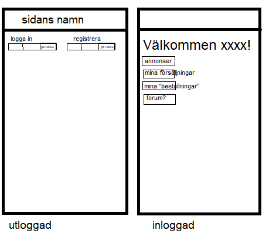
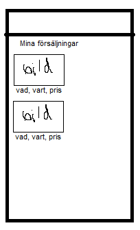

# Projektplan

## 1. Projektbeskrivning (Beskriv vad sidan ska kunna göra).
Mitt projekt ska vara en blocket liknande sida där det kommer att finnas en inloggningssida, ett forum sida, försäljningssida, annonssida samt ett beställningsida. Det kommer att finnas 3 main funktioner (4 main-sidor): försäljning, köp samt forum där man kan fråga frågor samt få information om saker, det kommer också finnas ett utloggad version där man inte får tillgång till något. Om man vill ha funktioner kommer man behöva registrera sig vilket sker med användarnamn samt lösenord. Man måste ha ett unik användarnamn för att fortsätta registreringen. Lösenord kommer att skyddad med hasher. Om man skriver in fel lösenord flera gånger får man en cooldown och efter eventuell flera fel kommer man att bli blacklistad tills man byter lösen (vet inte hur jag kommer att göra det nu men kommer försöka göra detta).  
## 2. Vyer (visa bildskisser på dina sidor).
  
<h3> I första sidan tänkte jag att jag kan ha två versioner, för inloggade och en för icke-inloggade. De som är inte inloggade kommer inte att få tillgång för funktioner, bara inloggning och registrering. Den andra sidan kommer att ha "annonser", "mina försäljningar", "mina beställningar" och något mer, kanske ett forum.</h3>  

 
<h3>I andra sidan tänkte jag att det skulle vara bra att ha anonnserna. Annonserna kommer att vara en och en, med information om vad det är (description) och vart den ligger samt priset.</h3> 

 
<h3>I den tredje sidan kommer jag att ha mina försäljningar</h3> 

## 3. Databas med ER-diagram (Bild på ER-diagram).

## 4. Arkitektur (Beskriv filer och mappar - vad gör/innehåller de?).
